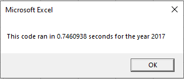
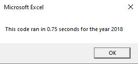

# Stocks Analysis

## OVERVIEW: VBA Stock Analysis Challenge

### Purpose
In this challenge, we will edit, or refactor, the Stock Market Dataset with VBA code to loop through all the data one time in order to collect an entire dataser. Then determine whether refactoring code successfully made the VBA script run faster. Finally, we want to make the code more efficient—by taking fewer steps, using less memory, or improving the logic of the code to make it easier for future users to read. 

### Our Challenge Data Background
Steve loves the workbook you prepared for him. At the click of a button, he can analyze an entire dataset. Now, to do a little more research for his parents, he wants to expand the dataset to include the entire stock market over the last few years. Although your code works well for a dozen stocks, it might not work as well for thousands of stocks. And if it does, it may take a long time to execute.

In this challenge, you’ll edit, or refactor, the Module 2 solution code to loop through all the data one time in order to collect the same information that you did in this module. Then, you’ll determine whether refactoring your code successfully made the VBA script run faster. Finally, you’ll present a written analysis that explains your findings.

Refactoring is a key part of the coding process. When refactoring code, you aren’t adding new functionality; you just want to make the code more efficient—by taking fewer steps, using less memory, or improving the logic of the code to make it easier for future users to read. Refactoring is common on the job because first attempts at code won’t always be the best way to accomplish a task. Sometimes, refactoring someone else’s code will be your entry point to working with the existing code at a job.

### Analysis and Challenges
The purpose of this challenge is too:

1. Prepare our dataset `VBA_Challenge.vbs` file for the project.
2. Create our resources folder in **GitHub** to hold the run-time pop-up messages that we’ll screenshot after running refactored analyses for 2017 and 2018.
3. Create and convert our `XLSM` file from `*.vbs` dataset that you used in this module as `VBA_Challenge.xlsm`.
4. Add the VBA_Challenge.vbs script to the Microsoft Visual Basic editor.
5. Use the steps **Refactor VBA code and measure performance** to add code where indicated by the numbered comments in the starter code file.
6. Compare the stock performance between 2017 and 2018, as well as the execution times of the original script and the refactored script.

### Results 

Overall 2017 was a great year for the given stocks as a whole, with only one ticker TERP showing negative return. The average return of all of the tickers was 67%. 2018 was quite the opposite with only two tickers, ENPH and RUN, have positive returns. Both, ENPH and RUN, were the only tickers to have postive years in 2017 and 2018. 

#### 2017 Run Time

#### 2018 Run Time

### Deliverable Requirements

## SUMMARY: Our Statement:

### Deliverable with detail analysis:
**1. What are the advantages or disadvantages of refactoring code?**

**Disadvantages:**
- The longer the code the harder it may be to comb through and find variables and other hard coded items that may need to change.
- Without detailed notes in the code determining what someone else or even yourself were trying to do may be diffcult and create further issues. 
- Trying to edit multiple lines and scroll through code making edits you may be more prone to a typo, which is something I encountered.

**Advantages:**
- Eliminate excess code and lines and creating a more streamline code to execute. This in turn should take a shorter amount of time for excel to run.
- Providing detailed notes and explination of code allows for and easier editing process in the future whether it be by the orginal owner or someone else.
- Having the detailed notes allows for easy changes and modifications both in the current code and for possibly using in other workbooks. 

**2. How do these pros and cons apply to refactoring the original VBA script?**

> - When starting with someonelse's work, like we did with the starter code, it was easy to determine what was trying to be accomplished with the given notes. It was also easy to idnetify what was going on since there was porper spacing and indentation. Having proper notes and indentation is may be more work upfront however, pays significant dividends down the road. 
> - Even with a starting point it still can be difficult to pick up where someone else left off simply because there are so many ways to execute tasks. The more you try and manipulate the more chance you have of a typo or syntax issue. This would be were using copy and paste from previous lines would come in handy. 

